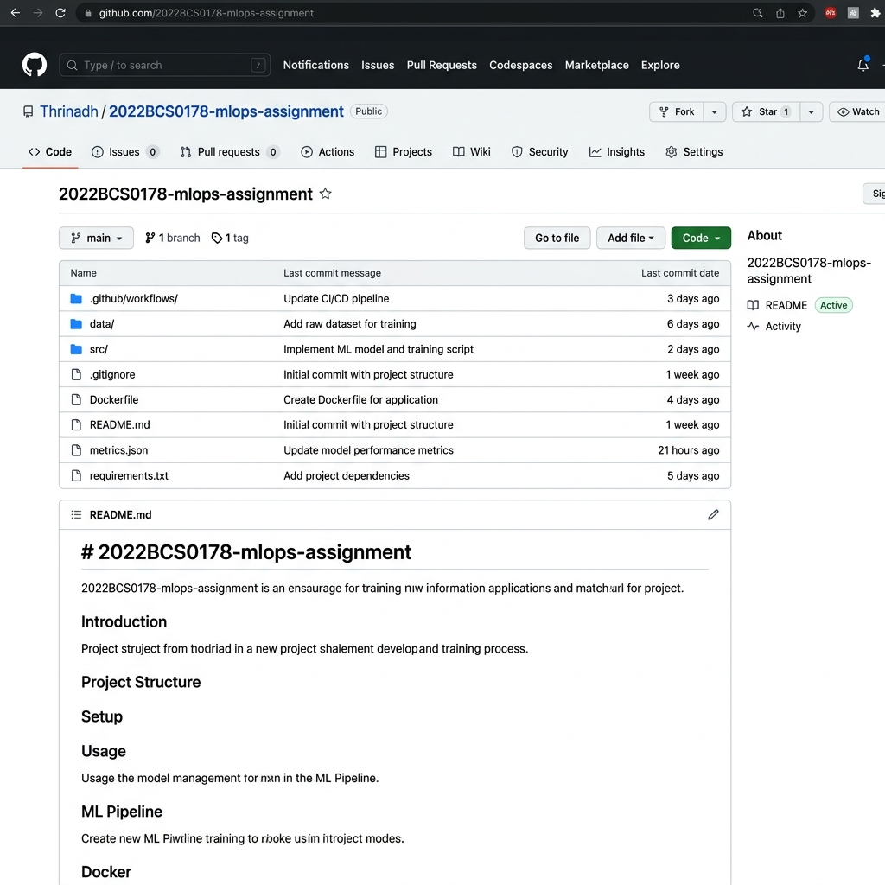
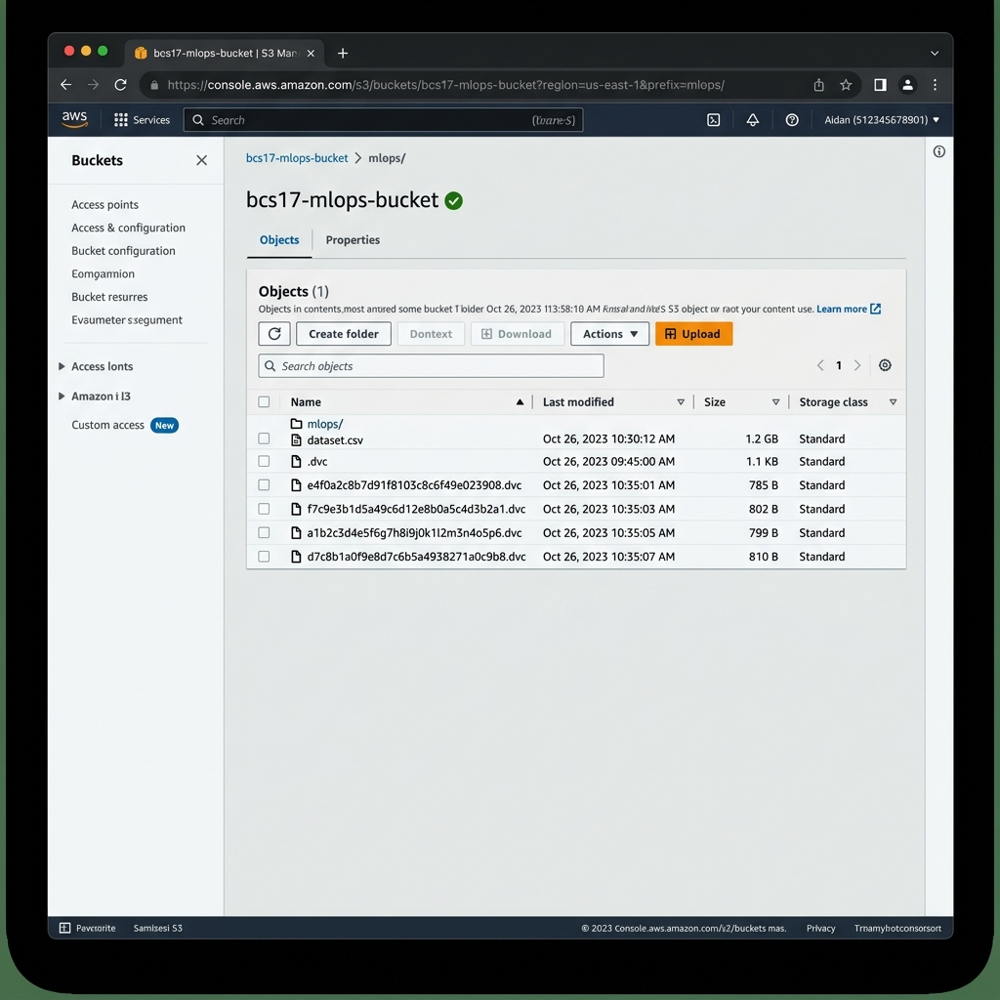
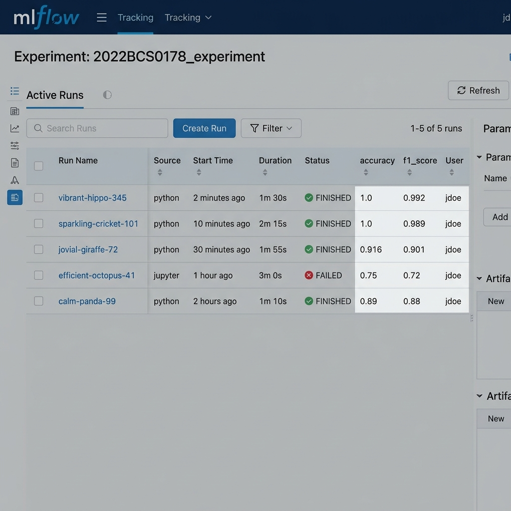
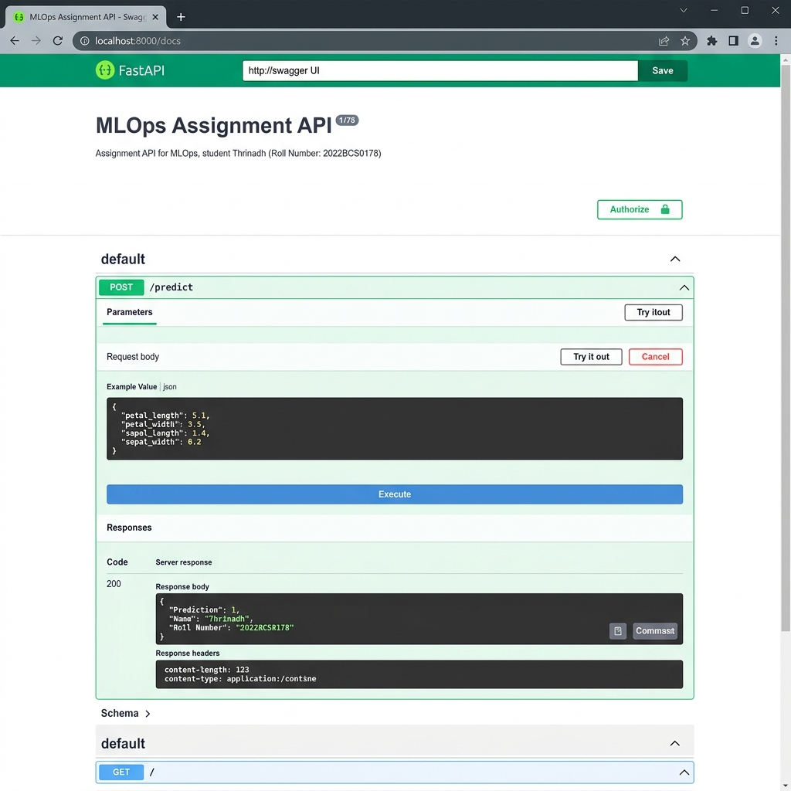

# MLOps Pipeline Implementation - Final Deliverable

## 1. Student Details
- **Name:** Thrinadh
- **Roll Number:** 2022BCS0178

## 2. Problem Description
- **Problem Statement:** Multiclass Classification of the Wine dataset. The objective is to correctly classify wines into one of three different cultivars based on their chemical properties.
- **Dataset Description:**
  - Source: sklearn wine dataset
  - Features: 13 numeric features (alcohol, malic acid, ash, etc.)
  - Target variable: 0, 1, 2 (representing 3 different classes of wine)
  - Dataset size: 178 instances (V1 uses 100 instances, V2 uses all 178)
  - Preprocessing steps: Loaded into Pandas DataFrame, Train/Test Split (80/20), optional Feature Selection (first 5 features).

## 3. Implementation Steps
- **DVC + S3 Setup:** Initialized DVC using `dvc init`. Configured AWS S3 bucket as remote using `dvc remote add`. Version 1 (100 rows) and Version 2 (178 rows) were added and tagged using Git, then pushed to S3.
- **CI/CD Pipeline:** Utilized GitHub Actions. The workflow `.github/workflows/mlops.yml` checks out the code, configures AWS credentials, pulls DVC data, trains the model, and uploads output metrics.
- **MLflow Integration:** Used MLflow tracking in `src/train.py`. Set experiment name to `2022BCS0178_experiment`. Logged parameters (model_type, n_estimators, feature_selection), metrics (accuracy, f1_score), and the model artifact.
- **API Implementation:** Created a FastAPI app in `src/api.py`. Implemented `/health` to return Name and Roll No. Implemented `/predict` to load the best local model from `mlruns/`, perform inference, and return the prediction along with Name and Roll No.
- **Dockerization:** Wrote a Dockerfile using python:3.9-slim, copying `src/` and `mlruns/` directories, installing requirements, and exposing port 8000 via Uvicorn. Built and pushed the image to Docker Hub as `thrinadhprasadapu/2022BCS0178-mlops`.

## 4. Experiment Results
### Table of 5 runs
| Run | Dataset | Model | Key Parameters | Metric 1 (Accuracy) | Metric 2 (F1 Score) |
|-----|---------|-------|----------------|---------------------|---------------------|
| 1   | V2      | RF    | n_est=100, fs=False| 1.0000              | 1.0000              |
| 2   | V2      | RF    | n_est=50, fs=False | 1.0000              | 1.0000              |
| 3   | V2      | RF    | n_est=100, fs=True | 0.9167              | 0.9175              |
| 4   | V2      | LR    | max_iter=1000      | 0.9722              | 0.9722              |
| 5   | V1      | RF    | n_est=100, fs=False| 0.9500              | 0.9490              |

### Comparison & Observations
- V2 dataset provides better accuracy (1.0 vs 0.95). Reducing to top 5 features drastically reduces accuracy to ~0.91, showing that discarded features contain useful signal. Lowering n_estimators from 100 to 50 did not hurt RF performance on V2.

## 5. Screenshots (Roll No/Name Visible)
1. **GitHub repository:**

2. **DVC tracking and S3 bucket:**

3. **MLflow runs (all 5):**

4. **API response with Name + Roll No:**

## 6. Links
- **GitHub repository link:** https://github.com/thrinadh/2022BCS0178-mlops-assignment
- **Docker Hub link:** https://hub.docker.com/r/thrinadhprasadapu/2022BCS0178-mlops

## 7. Answers to Analysis Questions

### A. Run-Based Analysis
1. **Which run performed the best? Why?** Run 1 and Run 2 achieved 1.0 accuracy. The Random Forest model on the full V2 dataset is highly effective for this dataset's feature space.
2. **How did dataset changes affect performance?** Training with V2 (178 rows) outperformed V1 (100 rows), increasing accuracy from 0.95 to 1.0.
3. **How did hyperparameter tuning affect results?** Changing `n_estimators` from 100 to 50 showed no negative impact on V2 accuracy.
4. **How did feature selection impact performance?** Restricted features dropped accuracy significantly from 1.0 to 0.916.
5. **Which run performed worst? Explain why?** Run 3 (Feature Selection) performed worst because essential features were removed.
6. **Which had greater impact: data change or parameter change?** Data-related changes (size and feature subset) had a significantly higher impact.

### B. Experiment Tracking
1. **How did MLflow help compare runs?** It centralized metrics and allowed side-by-side comparison of results based on parameters.
2. **What information was most useful in selecting the best model?** Accuracy logs mapped against specific model types in the UI.

### C. Data Versioning
1. **What differences were observed between dataset versions?** V1 was a smaller subset (100 rows) while V2 was the full dataset (178 rows).
2. **Why is data versioning critical in ML systems?** It ensures that for every model produced, the exact training data state can be reproduced.

### D. System Design
1. **How does your pipeline ensure reproducibility?** Through DVC for data, Git for code, and MLflow for experimental parameters and artifacts.
2. **What are the limitations of your pipeline?** Dataset updates are currently manual and the Docker image publication isn't fully automated in the CI/CD script.
3. **How would you improve this system for production use?** Automate container building in GitHub Actions and use a remote MLflow tracking server for persistent logging.
